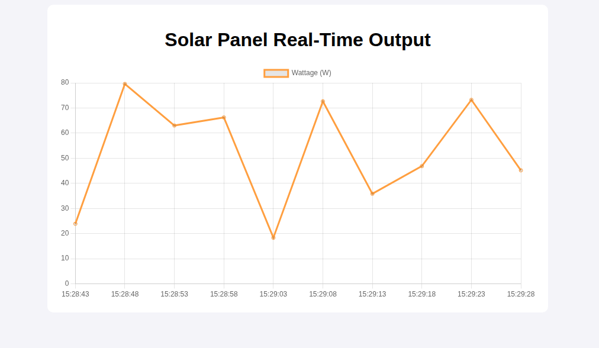

# 🚀 IoT Solar Power Monitor


- Title: Real-Time Solar Energy Monitoring System
- Version: 1.0.0-SNAPSHOT
- Status: Stable / In-Development

## 📝 Description
The IoT Solar Power Monitor is a full-stack Spring Boot application designed to track and visualize energy production from solar panels. It features an automated backend for data ingestion, a simulated sensor service for testing, and a real-time graphical dashboard.

This project is optimized for Ubuntu 24.04 environments and uses Maven for dependency management.

## ✨ Features
Real-Time Data Visualization: Interactive line charts using Chart.js.

RESTful API: Dedicated endpoints for IoT devices (ESP32/Arduino) to POST sensor data.

Automation Service: Background tasks for system health checks and data simulation.

Database Integration: H2 In-Memory database for development (PostgreSQL ready).

Modern Backend: Built with Spring Boot 3.2.5 and Java 17+.

## 🛠️ Tech Stack
- Language: Java 17
- Framework: Spring Boot 3.2.5
- Build Tool: Maven
- Frontend: Thymeleaf, HTML5, Chart.js
- Database: H2 (Development) / PostgreSQL (Production)
- OS: Ubuntu 24.04 LTS

## 🚀 Getting Started
Prerequisites
Java 17 or higher

Maven 3.6+

Installation & Run
Clone the repository:

```Bash
git clone https://github.com/bundlab/solar-monitor.git
cd solar-monitor
Build the project:
```
```Bash
mvn clean install
Run the application:
```
```Bash
mvn spring-boot:run
Access the Dashboard:
Open your browser and navigate to: http://localhost:8080/dashboard
```
## 🔌 API Documentation
Upload Reading
POST /api/solar/upload

```JSON
{
  "voltage": 18.5,
  "current": 2.1
}
Get Latest Stats
GET /api/solar/stats
```
Returns the last 10 readings in JSON format.

## 📂 Project Structure
```Plaintext
solar-monitor/
├── src/
│   ├── main/
│   │   ├── java/com/solar/
│   │   │   ├── controller/   # Web and REST Controllers
│   │   │   ├── model/        # Data Entities
│   │   │   ├── repository/   # Database Access
│   │   │   └── service/      # Background Tasks
│   │   └── resources/
│   │       ├── templates/    # HTML Dashboard
│   │       └── application.properties
└── pom.xml
```
## 👤 Author
bundlab

Ubuntu 24.04 Enthusiast | AI Developer